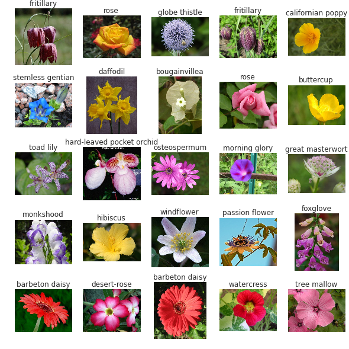
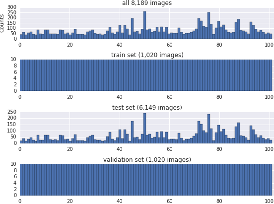

# caffe-oxford102

This bootstraps the training of deep convolutional neural networks with [Caffe](http://caffe.berkeleyvision.org/) to classify images in the [Oxford 102 category flower dataset](http://www.robots.ox.ac.uk/~vgg/data/flowers/102/index.html). The prototxt files for fine-tuning AlexNet and VGG_S models are included and use initial weights from training on the [ILSVRC 2012 (ImageNet) data](http://www.image-net.org/challenges/LSVRC/2012/). 

To download the Oxford 102 dataset, prepare Caffe image files, and download pre-trained model weights for AlexNet and VGG_S, run

```bash
python bootstrap.py
```
This will give you some pretty flower pictures:



The categories are split into training, testing, and validation sets. It seems odd that there are more testing images than training images.



## AlexNet

This model is a [slightly modified](http://caffe.berkeleyvision.org/gathered/examples/imagenet.html) version of the [ILSVR 2012](http://www.image-net.org/challenges/LSVRC/2012/) winning [AlexNet](http://papers.nips.cc/paper/4824-imagenet-classification-with-deep-convolutional-neural-networks). The number of outputs in the inner product layer has been set to 102 to reflect the number of flower categories. Hyperparameter choices in `AlexNet/solver.prototxt` reflect those in [Fine-tuning CaffeNet for Style Recognition on “Flickr Style” Data](http://caffe.berkeleyvision.org/gathered/examples/finetune_flickr_style.html). The global learning rate is reduced while the learning rate for the final fully connected layer is increased relative to the other layers.

Once you've run the `bootstrap.py` script, you can begin training from this directory with:

```bash
cd AlexNet
$CAFFE_HOME/build/tools/caffe train -solver solver.prototxt -weights pretrained-weights.caffemodel -gpu 0
```

After 50,000 iterations, the top-1 error is 7% on the test set of 1,020 images:
```
I0215 15:28:06.417726  6585 solver.cpp:246] Iteration 50000, loss = 0.000120038
I0215 15:28:06.417789  6585 solver.cpp:264] Iteration 50000, Testing net (#0)
I0215 15:28:30.834987  6585 solver.cpp:315]     Test net output #0: accuracy = 0.9326
I0215 15:28:30.835072  6585 solver.cpp:251] Optimization Done.
I0215 15:28:30.835083  6585 caffe.cpp:121] Optimization Done.
```

The Caffe model can be downloaded at https://s3.amazonaws.com/jgoode/oxford102.caffemodel. You can also use the Caffe utility to download from its [gist](https://gist.github.com/jimgoo/0179e52305ca768a601f):

```bash
cd $CAFFE_HOME
./scripts/download_model_from_gist.sh 0179e52305ca768a601f <dirname>
```


## VGG-S

This is [another popular CNN](http://www.robots.ox.ac.uk/~vgg/research/deep_eval/) from the University of Oxford Visual Geometry Group (VGG). On ILSVRC 2012, it has a top-5 error rate of 13.1% compared to 15.3% for AlexNet.

Getting the prototxt file setup for training took a little more work because only the `deploy.prototxt` file was provided. I added the same learning rate multipliers for each layer as the AlexNet one and the same weight initialization schemes, although the latter was redundant when starting with pre-trained weights. The same random cropping and mirroring are also used. 

To train,

```bash
cd VGG_S
$CAFFE_HOME/build/tools/caffe train -solver solver.prototxt -weights pretrained-weights.caffemodel -gpu 0
```

After 14,500 iterations, this model does a little better with top-1 error of 5%. I stopped at 14,500 iterations because the loss had basically flat-lined:

```
I0917 13:26:48.291409 17111 solver.cpp:189] Iteration 14450, loss = 0.000572158
I0917 13:26:48.291549 17111 solver.cpp:464] Iteration 14450, lr = 0.001
I0917 13:27:52.307510 17111 solver.cpp:266] Iteration 14500, Testing net (#0)
I0917 13:28:50.950788 17111 solver.cpp:315]     Test net output #0: accuracy = 0.951129
```

AlexNet uses a crop size of 227 x 227, while VGG_S uses 224 x 224, so it's not an exact comparison.

## Notes

- The class labels for each species were deduced by Github user [m-co](https://github.com/m-co) and can be found in the file `class-labels.py`. They are in order from class 1 to class 102 as used in the mat files.

- These were run using the mean image for [ILSVRC 2012](http://www.image-net.org/challenges/LSVRC/2012/) instead of the mean for the actual Oxford dataset. This was more out of laziness that anything else.

- [This paper](http://arxiv.org/abs/1403.6382) reports 87% top-1 accuracy on the Oxford-102 dataset using an SVM on features from the [OverFeat model](http://cilvr.nyu.edu/doku.php?id=code:start). I couldn't tell which split they used for training.